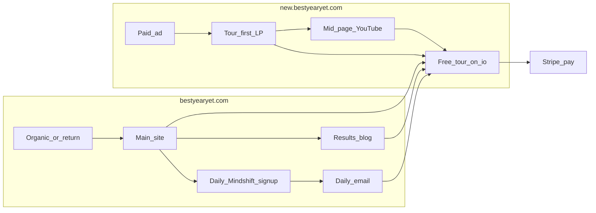

# DTC Conversion Execution Plan

**Canonical shared plan — all teams execute against this document.**  
**Date:** 2026-07-10  
**Analytics repo mirror:** `BYY-Marketing/docs/DTC_CONVERSION_EXECUTION_PLAN_2026-07-10.md`  
**Scope:** Individuals / DTC only  
**Primary KPI:** Stripe subscription / payment  
**Secondary KPI:** Free tour start → complete (leading indicator)

**Related shared docs:**

| Doc | Role |
|-----|------|
| [07.10.26-RAILS_TOUR_AND_SIGNUP_INSTRUMENTATION.md](./07.10.26-RAILS_TOUR_AND_SIGNUP_INSTRUMENTATION.md) | Tour + `sign_up` tagging (Rails — completed) |
| [07.10.26-META_PIXEL_FBQ_RACE_CONDITION.md](./07.10.26-META_PIXEL_FBQ_RACE_CONDITION.md) | Meta Pixel fix (GTM v14 — completed) |
| [ENGAGEMENT_TRACKING.md](./ENGAGEMENT_TRACKING.md) | LP scroll / CTA / video events |
| [CROSS_DOMAIN_TRACKING.md](./CROSS_DOMAIN_TRACKING.md) | CTA linker / attribution |

---

## 1. Diagnosis snapshot (locked)

**Window:** 2026-01-01 → 2026-07-07 (H1 midyear snapshot + live UX).

| Finding | Implication |
|---------|-------------|
| ~34.9k human visits → **46 Stripe customers (0.13%)** | Wall is acquisition → first pay |
| Direct converts ~**16× Meta** (0.32% vs 0.02%); TikTok **0%** | Cold paid does not buy on first click; middle-funnel trust is the growth product |
| Retention healthy (net +21, ~3.4% churn) | Product stickiness after pay is OK |
| GA4 `sign_up` was 0; tour events missing | Soft path was invisible (instrumentation) |
| Live `new` was hard-pay primary; wrong stats (44 / 100k+) | LP contradicted persona strategy |

**Constraints still locked:** Price already tested (deprioritize). Trial not live (retest later via A/B). Budget flexible if conversion proven.

---

## 2. Funnel roles (do not blur)

| Surface | Job | Soft conversion | Hard conversion |
|---------|-----|-----------------|-----------------|
| `new.bestyearyet.com` | Cold paid → trust → tour | Free tour only (**no email form**) | Secondary pay links |
| `bestyearyet.com` | Organic / return / nurture | Tour + Results + Daily Mindshift | Secondary → `.io/pricing` |
| `bestyearyet.io` | Product experience | Tour complete | Pricing / Stripe |

---

## 3. Locked product decisions

| Decision | Choice |
|----------|--------|
| Featured YouTube on `new` | [An Intro to Your Best Year Yet](https://youtu.be/7mKB0h-e-os) (`7mKB0h-e-os`, 1:08) |
| Newsletter on `new` | **No** |
| Soft email on main | Revive **Daily Mindshift** — image + quote from Rails DB (same content as in-app DMS) |
| Blog | Existing `/results` React SSG; launch at **6** posts |
| Tour-first CTAs + canonical stats | LP PR [#8](https://github.com/twminn/byy-landing-pages/pull/8) |

---

## 4. Execution backlog (ordered)

### Done (2026-07-10)

| # | Item | Evidence |
|---|------|----------|
| D1 | Rails tour + signup instrumentation | This folder — Rails completed tagging |
| D2 | GTM v14: `tour_*` tags; Meta Pixel `fbq` race fix | Live: `tour_start` / `tour_step` in dataLayer; `fbq` defined |
| D3 | Tour-first CTA + canonical stats PR | [byy-landing-pages#8](https://github.com/twminn/byy-landing-pages/pull/8) — **merged + deployed 2026-07-10** |
| D4 | Diagnosis docs in Analytics repo | `BYY-Marketing/docs/` |

### Now — highest leverage

| # | Item | Owner | Repo / surface | Status |
|---|------|-------|----------------|--------|
| N1 | **Merge + deploy LP PR #8** (`new` + main hero) | Frontend | `byy-landing-pages` | **Done** 2026-07-10 |
| N2 | Re-verify GA4 soft path 24–48h | Analytics | BYY-Marketing verify script | Pending lag |
| N3 | Install Microsoft Clarity via GTM | Analytics | GTM `GTM-K9PVK9ZF` | Spec in Analytics repo |
| N4 | Locate non-converter email in GHL UI; fix CTAs → tour | Marketing / GHL | GHL | Manual |
| N5 | Finish YouTube OAuth (dev branch → ECS secrets) | Analytics | BYY-Marketing | Pending |

### Next — soft engagement build

| # | Item | Owner | Notes |
|---|------|-------|-------|
| S1 | Mid-page YouTube on `new` (after N1) | Frontend | Between Credibility → Process; tour CTA beside embed; **no DMS form** |
| S2 | Spec tour shell brand continuity + remove mid-tour hard-pay interrupt | Rails + Frontend | Brand/voice match marketing; Continue Tour stays primary mid-tour |
| S3 | Results blog: ship to **6** posts; enable nav/sitemap/index | Content + Frontend | `apps/bestyearyet`; `MIN_PUBLISHED_POSTS = 6` |
| S4 | Sitemap: add `/how-it-works` | Frontend | `sites/bestyearyet/sitemap.xml` |
| S5 | Daily Mindshift email revival | Rails + GHL + Frontend | Rails = content source; GHL = send; main + Results footers = capture |
| S6 | Meta retargeting (LP engagers / tour abandoners) | Ads | After tour events stable in GA4 |
| S7 | Pause / minimize cold TikTok until soft path converts | Ads | Data-backed |

### Later

| # | Item |
|---|------|
| L1 | Mini barrier quiz on `new` if video + tour-first underperform |
| L2 | Trial A/B on new app |
| L3 | Message-match LP variants for life-transition creatives |

---

## 5. Team action briefs

### Frontend (`byy-landing-pages`)

1. **N1:** Merge/deploy PR #8 (tour-first CTAs + canonical stats on `sites/new` and main hero).
2. **S1:** Add Video section on `sites/new` after Credibility, before Process:
   - Embed `7mKB0h-e-os` (prefer `youtube-nocookie.com` if CookieYes requires)
   - No autoplay with sound; lazy-load
   - Primary CTA: free tour (`handleTourClick` / existing pattern)
   - Quiet YouTube channel link only — not a peer CTA
   - `data-track-section="Video"` + `video_engagement` per [ENGAGEMENT_TRACKING.md](./ENGAGEMENT_TRACKING.md)
3. **S3–S4:** Results to 6 posts; enable nav/footer/sitemap; add `/how-it-works` to sitemap.
4. **S5 (capture UI):** DMS email signup on main footer + Results post footers only — **never on `new`**.

### Rails (`byy-rails` / `bestyearyet.io`)

1. **Done:** Tour + signup instrumentation (verify with Analytics).
2. **S2:** Tour shell continuity — match marketing brand/voice; keep mid-tour primary action as Continue Tour (not hard pay).
3. **S5:** Confirm Daily Mindshift DB model/table; expose read-only “today’s DMS” (`image_url`, `quote`, `date`). Default send path: Rails cron → GHL/ESP with image+quote payload. Do not duplicate content into GHL.

### GHL / Marketing

1. **N4:** Find live non-converter / registrant recovery sequence; CTAs → free tour with UTMs; exclude active Stripe subs.
2. **S5:** Tag `daily-mindshift`; daily send template (image + quote); unsubscribe/consent; email CTA to tour:
   `https://bestyearyet.io/?utm_source=email&utm_medium=dms&utm_campaign=daily_mindshift&source=dms`

### Analytics

1. **N2 / N3 / N5:** Soft-path verify, Clarity, YouTube OAuth.
2. Keep this doc and the Analytics mirror in sync when backlog status changes.

### Ads

1. **S6–S7:** Retarget engagers/abandoners; do not scale cold TikTok until soft path converts.
2. Prefer tour-entry UTMs in creative destinations over hard pay.

---

## 6. Soft engagement specs (detail)

### 6.1 `new` YouTube

Placement after Credibility / before Process. Headline bridges “Unstuck” LP to tour (video is a calm channel intro, not a stuck-story creative). Success metrics: section views, play rate, tour CTA from video section vs hero — not direct Stripe lift alone.

### 6.2 Main site

Tour primary; pay secondary. Quizlet already soft-engages — skip homepage YouTube unless scroll/Clarity shows a clear drop. Results post CTAs: `utm_source=blog&utm_medium=results&utm_content={slug}`.

### 6.3 Daily Mindshift

Historical format: simple image + quote. Same Rails content as in-app DMS. Email is a **marketing nurture companion**, not a replacement for in-app DMS.

---

## 7. Instrumentation & verify

| Check | How |
|-------|-----|
| Tour events | dataLayer on `.io` has `tour_start` / `tour_step` (confirmed 2026-07-10). Analytics re-checks GA4 API after 24–48h |
| Meta Pixel | `typeof fbq === 'function'` on tour pages (GTM v14) |
| Video (post-S1) | `video_engagement` + tour CTAs from Video section |
| DMS | GHL tag volume; GA4 `utm_medium=dms` → tour / purchase |
| Clarity | Marketing sites first; add `.io` after tour events stable |

**IDs:** GTM `GTM-K9PVK9ZF` · App tour tags → `G-X84EPSV1L1`

---

## 8. Explicit non-goals

- Newsletter / DMS form on `new.bestyearyet.com`
- Multiple YouTube embeds on either homepage
- Scaling cold TikTok before soft-path rates improve
- Replacing in-app Daily Mindshift
- Price re-tests until soft path is measurable

---

## 9. Success criteria (next 14–30 days)

1. PR #8 live on `new` + main.
2. GA4 shows non-zero `tour_start` / `tour_step` (and `sign_up` when registrations occur).
3. Video section live on `new` with measurable play → tour CTA rate.
4. Non-converter email audited; CTAs point at tour.
5. Clarity recording marketing sites.
6. Results on track to 6 posts; DMS Rails content source confirmed and handoff opened.
